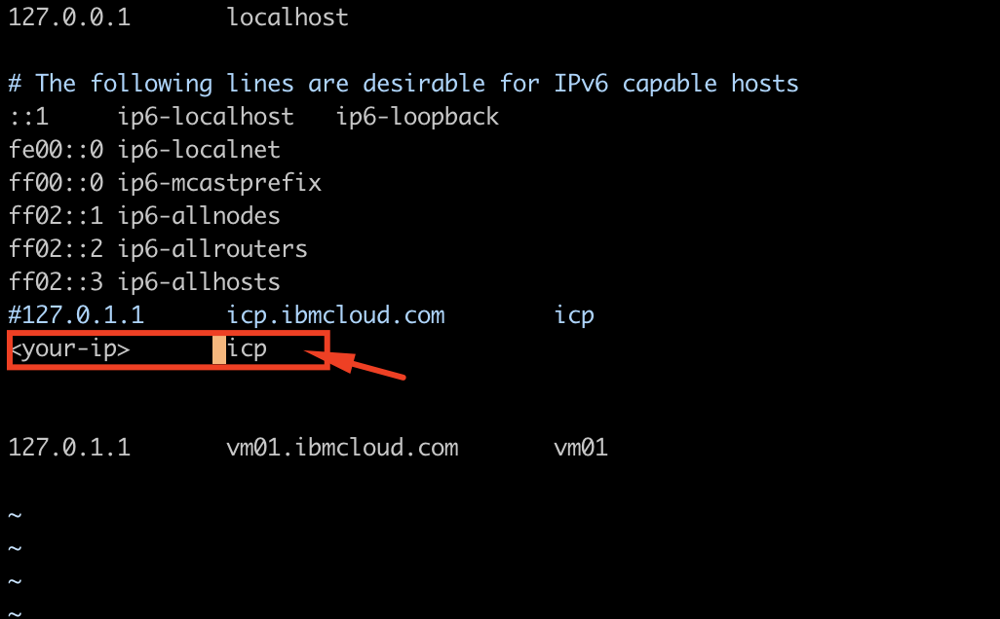
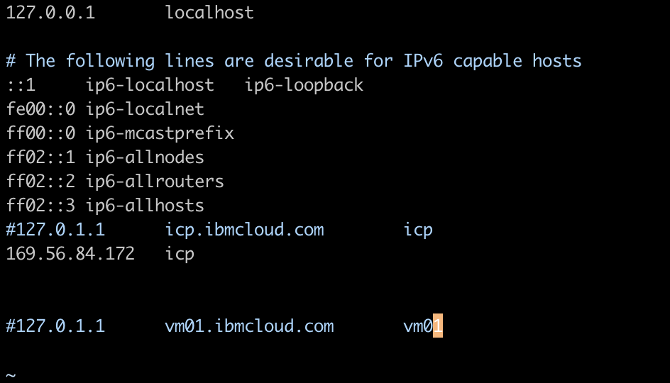
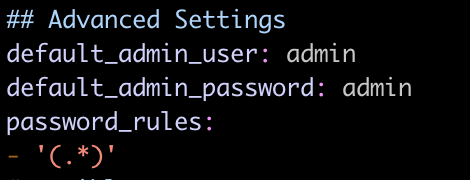
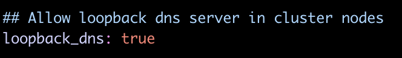
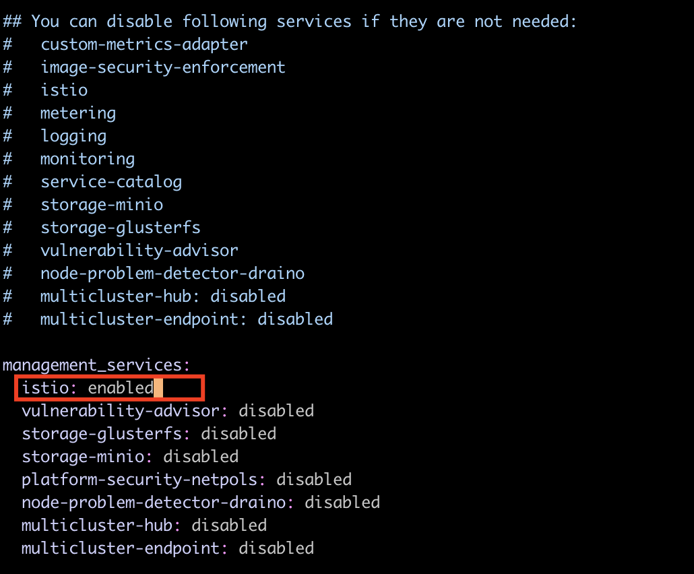
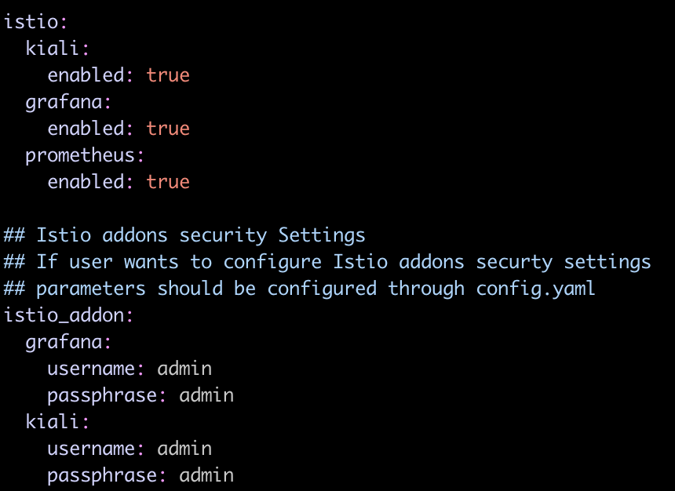
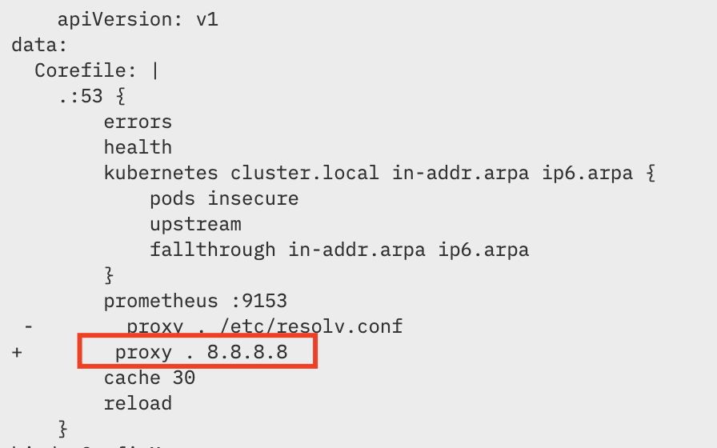

# IBM Cloud Private 설치 

## IBM Cloud Private CE (Community Edition) 설치하기
설치 매뉴얼 전문은 [Knowledge Center](https://www.ibm.com/support/knowledgecenter/SSBS6K_2.1.0.3/installing/install_containers_CE.html) 를 참고하시기 바랍니다.
본 실습은 편의성을 위해 Single Node에 Kubernetes 클러스터를 설치합니다.


### Pre-requisite 
`Hosts` 파일 수정하기 
```
vi /etc/hosts
```

1. 할당받은 VM의 IP 주소를 확인합니다. 

2. hostname과 IP를 추가합니다. 
**hostname**은 vm0[N] 입니다. 예를 들어, 저는 _**vm01**_ 이 hostname 입니다. 
세션에 들어오시면서 받으신 VM의 hostname을 기억해주세요! 

    [완료된 화면]
    

3. `127.0.1.1`은 주석처리 해주세요. 
    ```
    169.56.84.172   icp


    #127.0.1.1      vm01.ibmcloud.com       vm01
    ```
    

### Step 1: Boot Node 에 Docker를 설치하기 (구성 완료. SKIP)
**Boot Node** 는 Kubernetes 클러스터를 설치, 업데이트하는 노드입니다. 
Boot Node 에 Docker를 설치하면 나머지 노드에는 IBM Cloud Private 설치 과정에서 자동으로 Docker가 설치하므로, Boot Node 에만 Docker를 설치합니다. 


### Step 2: 설치 환경 셋업하기
1. **Boot Node**에 로그인
SSH 혹은 Putty로 실습 환경 IP에 접속합니다. 

2. [Docker Hub](https://hub.docker.com/r/ibmcom/icp-inception/)로부터 IBM Cloud Private-CE 설치 이미지 다운로드합니다.
    ```
    docker pull ibmcom/icp-inception:3.1.2
    ```

3. IBM Cloud Private 설정 파일을 저장하기 위한 설치 디렉토리 생성
    ```
    sudo mkdir /opt/ibm-cloud-private-3.1.2;
    cd /opt/ibm-cloud-private-3.1.2
    ```
 
 4. 설정 파일 압축 풀기
    ```
    sudo docker run -e LICENSE=accept \
    -v "$(pwd)":/data ibmcom/icp-inception:3.1.2 cp -r cluster /data
    ```
    `cluster` 디렉토리는  설치 디렉토리 안에 생성됨. `/opt` 밑에 `/opt/cluster` 와 같이 생성됨


 5. 클러스터를 구성하는 노드간 secure connection 을 생성하기 위해 SSH Key 생성 
    ``` 
    ssh-keygen -b 4096 -f ~/.ssh/id_rsa -N ""
    ```
 
 6. 생성된 key를 각 클러스터 노드에 추가
    ```
    ssh-copy-id -i ~/.ssh/id_rsa.pub <user>@<node_ip_address>
    ```  

     본 튜토리얼은 하나의 노드만 사용하므로 단일 노드에만 명령어를 실행하면 되지만, 실제 개발/운영시에는 여러 상호 노드 간 SSH 통신이 가능하게 해주어야 합니다. 자세한 내용은 다음 링크를 참고하세요. [Knowledge Center - SSH Key 설정하기](https://www.ibm.com/support/knowledgecenter/SSBS6K_3.1.2/installing/ssh_keys.html)

7. 클러스터 노드간 통신에 SSH 키를 사용하기 위해 `/<installation_directory>/cluster` 폴더에 `ssh_key` 파일을 덮어씁니다. 
    ```
    sudo cp ~/.ssh/id_rsa ./cluster/ssh_key
    ``` 

 8. `/opt/ibm-cloud-private-3.1.2/cluster/hosts` 파일에 노드의 IP 주소 입력
    ```
    vi /opt/ibm-cloud-private-3.1.2/cluster/hosts
    ``` 

    아래와 같이 hosts 파일을 수정합니다. 
    `169.56.84.172` 대신 각자 받으신 VM 의 IP를 입력하시면 됩니다. 
 
    ```
    [master]
    169.56.84.172

    [worker]
    169.56.84.172

    [proxy]
    169.56.84.172

    #[management]
    #4.4.4.4

    #[va]
    #5.5.5.5
    ```


### Step 3: 클러스터 설치 옵션
`cluster/config.yaml` 파일 설정을 통해 IBM Cloud Private 설치시 다양한 옵션을 설정합니다.

```
vi /opt/ibm-cloud-private-3.1.2/cluster/config.yaml
```
1. 관리자 username과 password 설정 
    ```
    default_admin_user: admin
    default_admin_password: admin
    password_rules:
    - '(.*)'
    ```
    

1. Loopback dns 을 true로 설정 
    ```
    loopback_dns: true
    ```
    

1. 로깅, 모니터링, 미터링 서비스는 기본적으로 설치하도록 명시 되어 있습니다. 만약 metering, monitoring 등의 서비스를 설치하지 않고자 할 때는 아래 `management_services` 값을 수정할 수 있습니다. 본 튜토리얼에서는 기본적인 관리 서비스 (metering, monitoring, service catalog)를 모두 설치합니다. Microservice mesh 인 Istio 도 함께 설치합니다.
  
    ```
    ## You can disable following services if they are not needed:
    #   custom-metrics-adapter
    #   image-security-enforcement
    #   istio
    #   metering
    #   logging
    #   monitoring
    #   service-catalog
    #   storage-minio
    #   storage-glusterfs
    #   vulnerability-advisor
    #   node-problem-detector-draino
    #   multicluster-hub: disabled
    #   multicluster-endpoint: disabled

    management_services:
      istio: enabled
      vulnerability-advisor: disabled
      storage-glusterfs: disabled
      storage-minio: disabled
      platform-security-netpols: disabled
      node-problem-detector-draino: disabled
      multicluster-hub: disabled
      multicluster-endpoint: disabled
    ```
    

1. Istio 설치를 위해 아래와 같이 설정 추가 
    ```
    istio:
      kiali:
        enabled: true
      grafana:
        enabled: true
      prometheus:
        enabled: true

    ## Istio addons security Settings
    ## If user wants to configure Istio addons securty settings
    ## parameters should be configured through config.yaml
    istio_addon:
      grafana:
        username: admin
        passphrase: admin
      kiali:
        username: admin
        passphrase: admin
    ```
    

1. 그 외에도 Ansible 설치 스크립트 실행시 다양한 옵션을 명시할 수 있습니다. 자세한 옵션은 [Config.yaml 파일로 클러스터 커스터마이즈 하기](https://www.ibm.com/support/knowledgecenter/en/SSBS6K_3.1.2/installing/config_yaml.html) 를 참고하시기 바랍니다. 
    <!--https://asciinema.org/a/ycmWE0uQ06tQXZUA9yTU0eH4H-->


## Step 4: IBM Cloud Private 설치 
1. 설치 디렉토리 내 `cluster` 폴더로 이동 
    ```
    cd /opt/ibm-cloud-private-3.1.2/cluster
    ```
2. IBM Cloud Private 클러스터 설치 
    ```
    docker run --net=host -t -e LICENSE=accept \
    -v "$(pwd)":/installer/cluster ibmcom/icp-inception:3.1.2 install
    ```

    Background로 실행하기 위해서는 아래의 커맨드 수행
    ```
    nohup docker run --net=host -t -e LICENSE=accept \
    -v "$(pwd)":/installer/cluster ibmcom/icp-inception:3.1.2 install &
    ```

3. 설치가 성공적으로 완료시 아래와 같이 뜹니다. 
    ```
    UI URL is https://master_ip:8443 , default username/password is admin/admin
    ```

    여기서 `master_ip`는 IBM Cloud Private master node의 IP 주소로, 실습 환경으로 부여받은 VM 의 IP와 같습니다. 

4. 설치 이후에 kube-dns 설정을 다시 업데이트 합니다. 
    ```
    kubectl edit cm kube-dns --namespace=kube-system
    ```

    ```
        apiVersion: v1
    data:
    Corefile: |
        .:53 {
            errors
            health
            kubernetes cluster.local in-addr.arpa ip6.arpa {
                pods insecure
                upstream
                fallthrough in-addr.arpa ip6.arpa
            }
            prometheus :9153
    -        proxy . /etc/resolv.conf
    +        proxy . 8.8.8.8
            cache 30
            reload
        }
    kind: ConfigMap
    ```
    

    ```
    [root@kvm-014377 ~]# kubectl get po -n kube-system |grep kube-dns 
    
    kube-dns-ldtqc 1/1 Running 0 30m
    
    [root@kvm-014377 ~]# kubectl delete po kube-dns-ldtqc -n kube-system pod "kube-dns-ldtqc" deleted
    ```


자, 이제 나만의 Kubernetes 환경이 여러가지 관리 서비스와 함께 설치 되었습니다. 
UI URL에 접속하여 대시보드를 둘러보세요!

