# ELK Stack를 활용한 플랫폼 로깅

IBM Cloud Private에서는 다음 두가지 타입으로 오픈소스인 ELK Stack을 사용해 로그를 수집합니다. 
- 플랫폼 로깅 - 기본으로 클러스터 설치시 함께 설치되는 ELK 스택으로 플랫폼 컴포넌트에 대한 로깅 
- 애플리케이션 로깅 - 카탈로그에서 ELK 스택을 배포해 각 네임스페이스별로 애플리케이션 로깅  

### 1. 플랫폼 로그를 위한 Kibana 세팅
 
1. **메뉴 > Platform > Logging** 클릭
2. 타임스탬프로 인덱스 패턴 설정 후 **Create** 클릭
- Time Filter field name : @timestamp

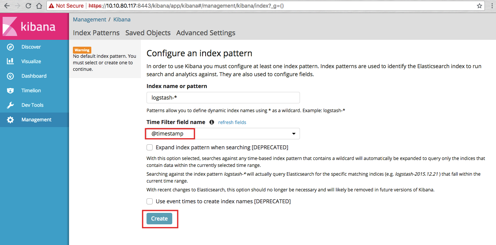

3. 좌측 상단의 **Discover** 클릭해 전체 로그 확인
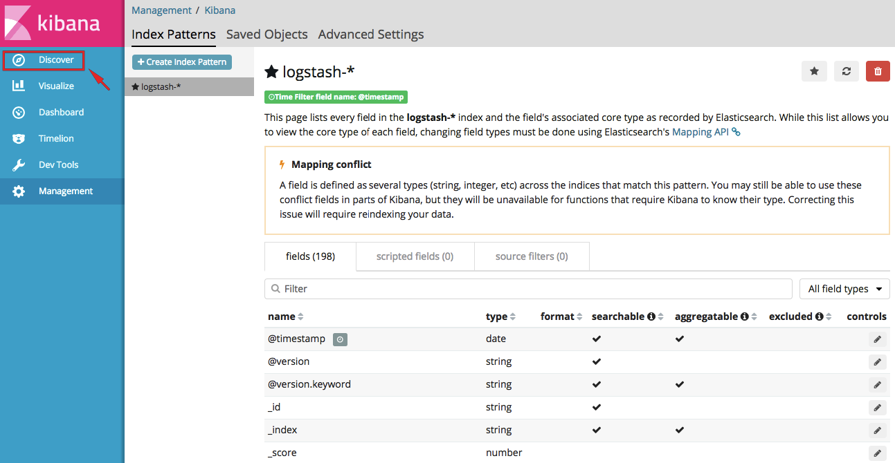

4. 가시성을 위해 Column 필드 설정.  왼쪽 **Available Fields** 에서 아래 필드 선택 후 **add** 클릭 
- _**node.hostname**_ (호스팅되는 노드)
- _**kubernetes.pod**_ (로그 생성 pod)
- _**kubernetes.container_name**_ (로그 생성 컨테이너 이름)
- _**log**_ (생성된 로그)

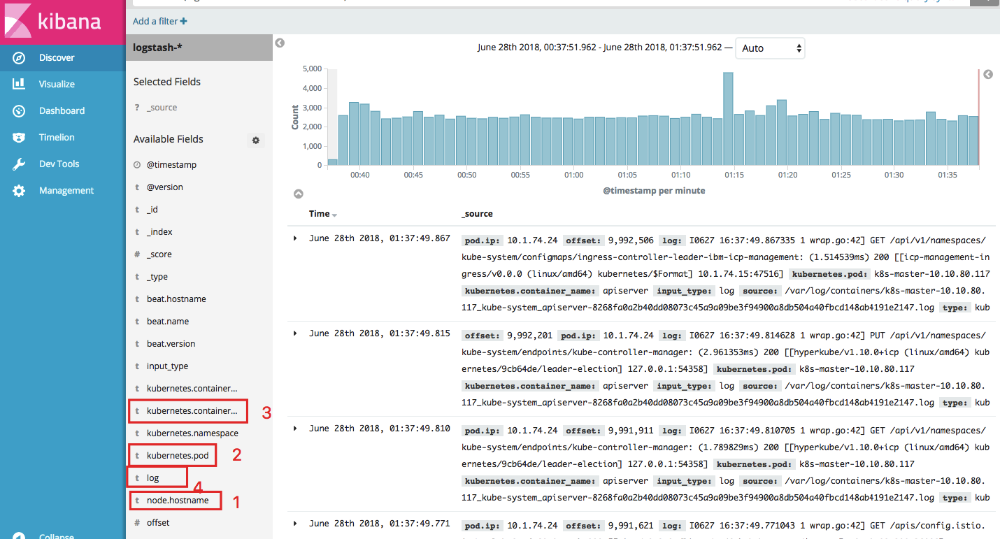

이제 로그를 실시간으로 스트리밍하도록 설정해보겠습니다. 

5. 우측 상단에서 Time Range 설정하기 위해 **Last 1 hour** 클릭

6. **Auto-refresh** 선택해 실시간 스트리밍
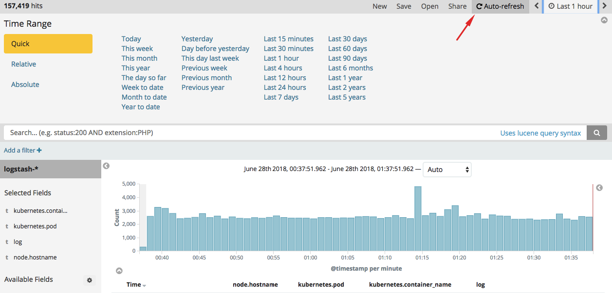

7. Kibana 대시보드의 리프레시 간격은 5초 혹은 10초로 설정 
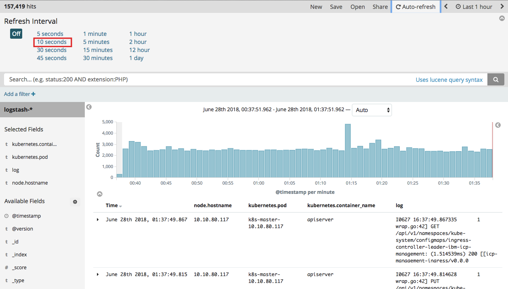

8. 이제 화면이 10초씩 자동으로 새로고침 되면서 실시간 로그가 설정된 포맷으로 출력됩니다. 
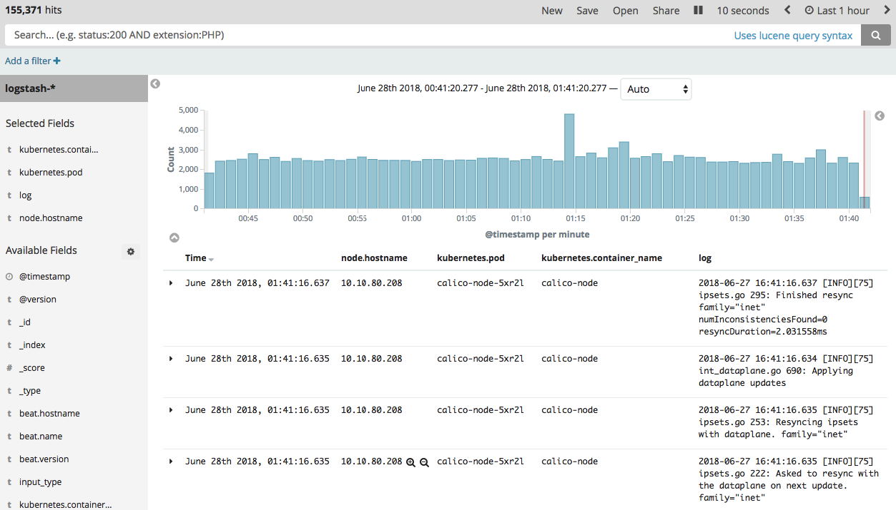

9. 실시간 로그 출력을 중단하기 위해 우측 상단 **10 seconds** 를 다시 클릭합니다. 
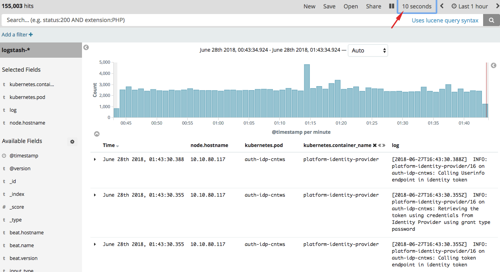

10. Off 를 클릭해 Refresh Interval을 중단합니다. 

11. 필터를 저장. 우측 상단의 **Save** 클릭
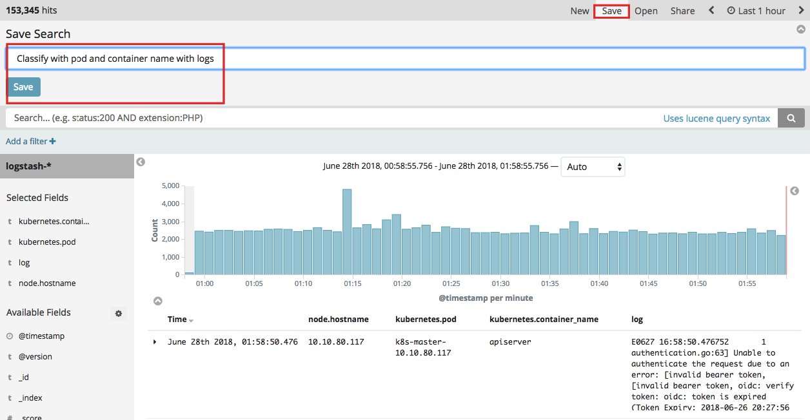

12. 그래프를 작성하기 위해 좌측 메뉴에서 **Visualize** 클릭
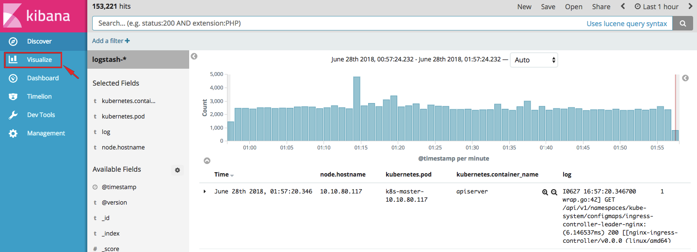

13. **Create a visualization** 클릭 > visualization type 으로 **pie** 선택
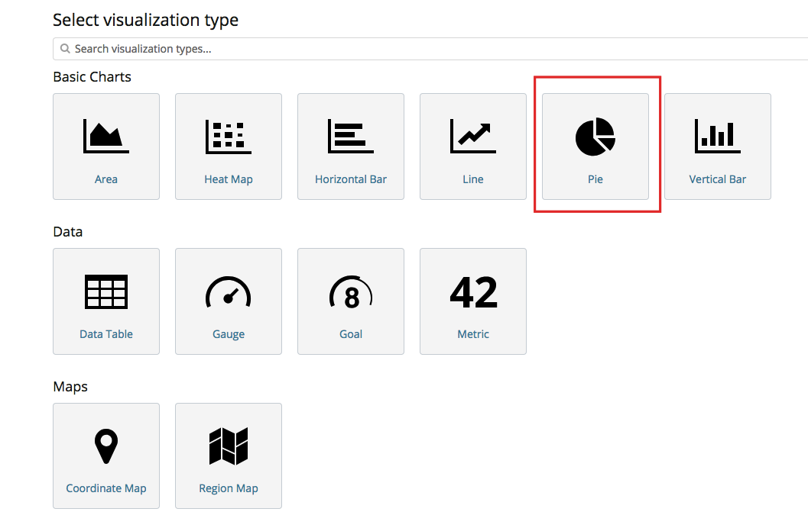

14. 새로운 **Search**로부터 그래프를 만들어 보겠습니다. (저장해놓은 Search도 사용 가능)

15. 첫 번째 bucket 생성
- Select buckets type : _**Split Slices**_
- Aggregation : _**Terms**_
- Field : _**kubernetes.pod.keyword**_
- Size : _**10**_

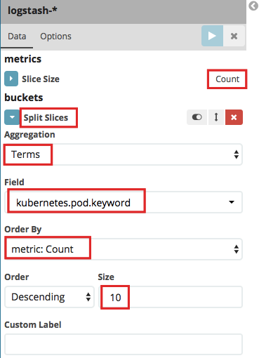

16. 아래 **Add sub-buckets** 버튼 클릭
- Select Sub buckets type : _**Split Slices**_
- Sub Aggregation : _**Terms**_
- Field : _**kubernetes.container_name:keyword**_
- Order By : _**metric: Count**_
- Order : _**Descending**_
- Size : _**5**_

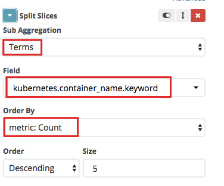

17. 실행 버튼 클릭 
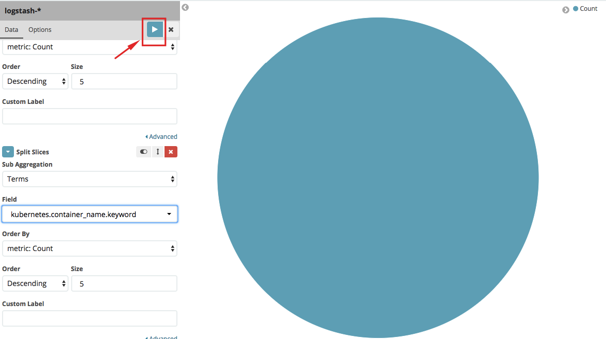

18. 그래프 생성 완료 후 저장
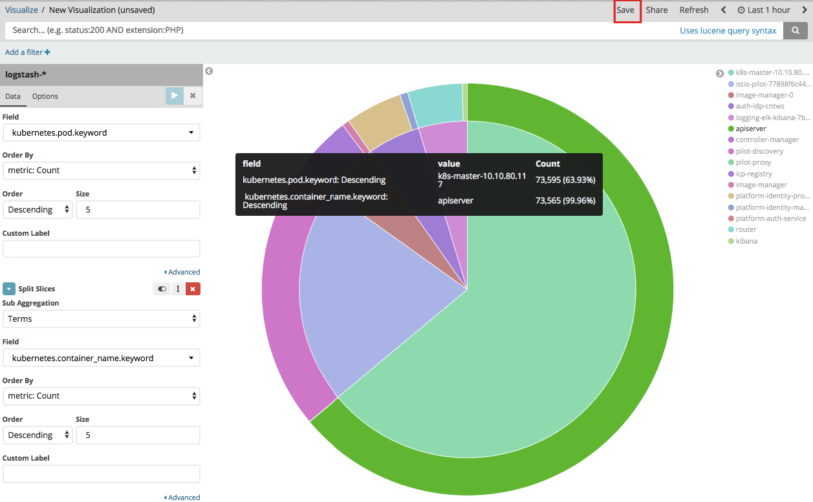
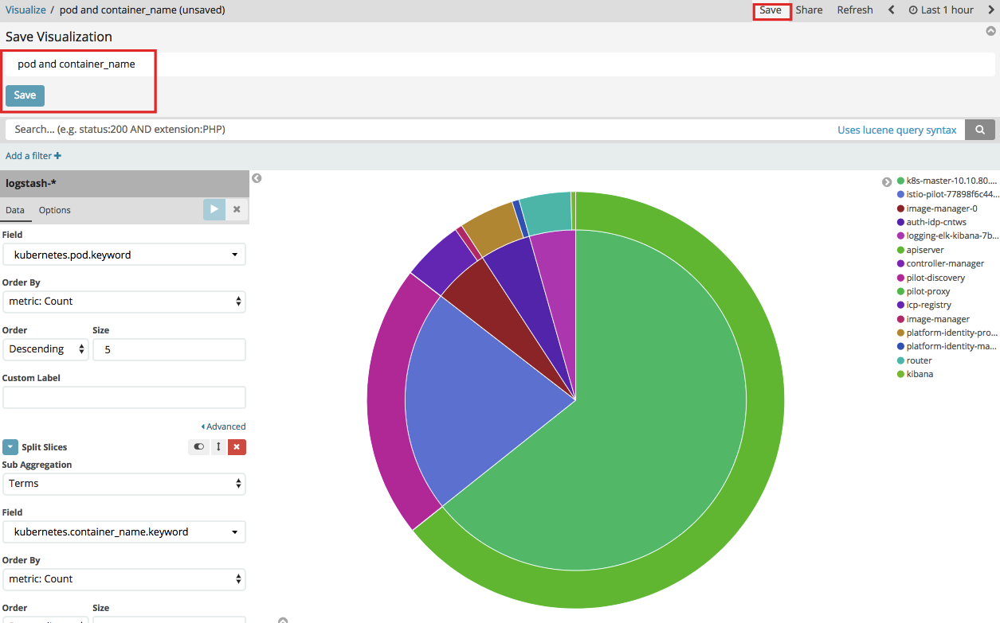

19. **Dashboard** 로 이동 후 **Create a dashboard** 클릭
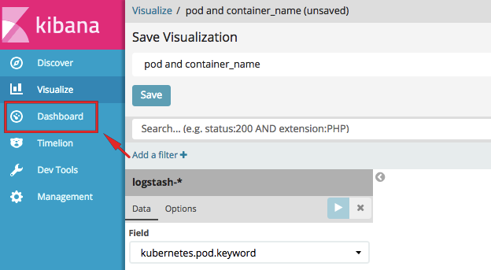

20. 조금 전 생성했던 Visualization을 대시보드에 추가

21. 우측 상단의 **Add** 로 그래프를 추가할 수도 있고 **Save**로 대시보드를 저장할 수도 있습니다. 

이번 실습에서는 시간 관계상 하나의 간단한 예시만 만들어 보았지만, 
더 많은 복잡한 내용으로 나만의 Kibana 대시보드를 만들 수 있습니다. 

